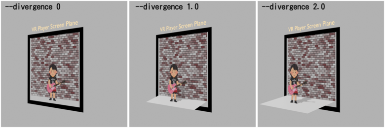
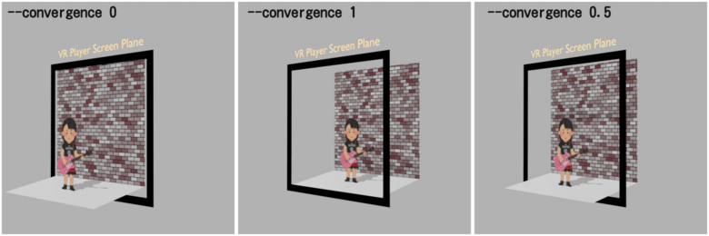

# iw3

I want to watch any 2D video as 3D video on my VR device, so I developed this very personal tool.

iw3 provides the ability to convert any 2D image/video into side-by-side 3D image/video. However, it does not support Anime.

This project is under construction.

## Overview

- Estimating depthmap using [ZeoDepth](https://github.com/isl-org/ZoeDepth)
- Generating side-by-side image using grid_sample based lightweight model that is trained with [stable-diffusion-webui-depthmap-script](https://github.com/thygate/stable-diffusion-webui-depthmap-script) 's method

## Usage

Run `iw3` module from the root directory of nunif.

```
python -m iw3 -i <input file or directory> -o <output file or directory>
```

When specifying a directory with the `-i` option, only image files within that directory will be processed.

If you want to process multiple video files, create a text file (e.g., `video_list.txt`) and list the file names inside it, with each file name on a new line. Then, specify the the text file, such as `-i video_list.txt`. Note that the text file is assumed to be in UTF-8 encoding.

```
python -m iw3 -i video_list.txt -o output_dir
```

The following command shows all available options:
```
python -m iw3 -h
```

Also, when running `iw3` for the first time, it may take some time as it needs to download large model files.

### What is `--divergence`(`-d`) option?



`2.0` by default. You can also specify `2.5`.

### What is `--convergence`(`-c`) option?



- `0` is good, but screen edge areas are hard to see.
- `1` is the most friendly for curved display setting.
- `0.5` by default.

## About VR Player

I have tested the results with the following software.

### Pigasus VR Media Player

Pigasus works perfectly for SBS 3D videos, images, and Samba drive(SMB).
However, I am not a big fan of its user interface and user experience.

If you can only choose one software, I would recommend this one.

### SKYBOX VR Video Player

I like this user interface, but 

- Loading image files from Samba drive is not supported (from the internal drive is supported)
- SBS 3D videos do not play with correct aspect ratio (See https://forum.skybox.xyz/d/407-full-sbs-3d , if the aspect ratio is a typical aspect ratio such as 4:3 or 16:9, you can manually fix it)
- Low FPS videos do not seek correctly (maybe FPS < 15)

Summary: If you want to play SBS videos with typical aspect ratio and fps, this software works.

## About file naming rule

VR Player detects media format by filename.
Adding `_LRF` suffix to the filename will identify the file as full side-by-side 3D media.

When specifying a directory with the `-o` option, it is automatically output as a filename with `{original_filename}_LRF.(png|mp4)`.

## Trouble shooting

### Very flat foreground

This tends to happen with outdoor scene photos.

There are some ways.
- Try `--mapper softplus2` option
- Try`--remove-bg` option

When `--mapper softplus2` is specified, the depthmap is remapped to see big differences on the foreground side. [mapper functions](https://github.com/nagadomi/nunif/assets/287255/0071a65a-62ff-4928-850c-0ad22bceba41)

When `--remove-bg` is specified, the background area is removed using [rembg](https://github.com/danielgatis/rembg) with [U2-net](https://github.com/xuebinqin/U-2-Net)'s human segmentation model, before estimating depthmap.

### Video encoding error

Please post to the issue about the format of the video.

### 60fps video drops to 30fps

By default, it is limited to 30fps.
Use `--max-fps 128` option.

### It's a giant!

This is a problem with SBS 3D video that it cannot be rendered in actual size scale.

You can try adjusting scale manually.

1. Use `--pad` option to adjust the frame scale
2. Adjust IPD scale 

On SKYBOX Player, set the 3D effect slider to around < -0.3.

On Pigasus, set `Settings > Advanced Settings > IPD` slider to large.

Also, on Pigasus, you can zoom and pan the image by double-clicking the trigger button on the VR controller.

### CUDA Out of Memory

Try `--disable-zoedepth-batch` option.

I tested this program on RTX 3070 Ti (8GB VRAM).
Perhaps 4GB VRAM should be enough to run this program.

### How to convert rotated(height width swapped) video correctly

Use `--rotate-left`(rotate 90 degrees to counterclockwise) or `--rotate-right`(rotate 90 degrees to clockwise) option to fix the rotation.

### Video is interlaced

Use `--vf yadif` option to deinterlace the video source.
You can use ffmpeg's video filter with `--vf` option.

Note that
- the video filter that modify the image size will cause errors
- only serial pipeline is supported

See https://ffmpeg.org/ffmpeg-filters.html

### Recommended workflow for slow processor or very large video

1. First check the results with a few samples. There are two ways.

The following command processes video keyframes about every 4 seconds and outputs the result as 3D photos (image files).
```
python -m iw3 --keyframe --keyframe-interval 4 -i input_video.mp4 -o output_dir/
```

The following command processes video frames every 2 seconds and outputs the result as 3D slideshow-like video (video file).
```
python -m iw3 --max-fps 0.5 -i input_video.mp4 -o output_dir/
```

If the results are acceptable, process the full video.

## Limitation

`--method row_flow`(by default) is currently only supports (`0 <= divergence <= 2.5` and `input width <= 1920`).
